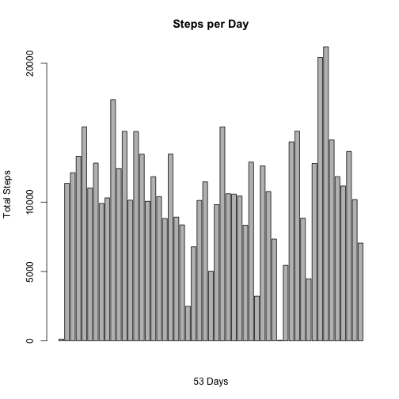
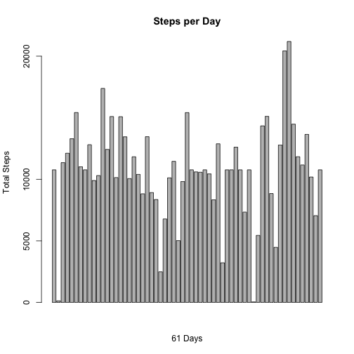
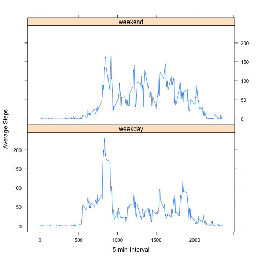

# Reproducible Research: Peer Assessment 1


## Loading and preprocessing the data
### Read the file and convert date string to date class type.

```r
library(plyr)
library(lattice)
adata = read.csv("activity.csv")
ddata <- as.Date(adata$date)
adata$date <- ddata
```


### Remove missing data

```r
clean_data <- adata[!is.na(adata$steps), ]
```


## What is mean total number of steps taken per day?
### Histogram of total number of steps taken each day

```r
steps_sum <- ddply(clean_data, ~date, summarise, sum = sum(steps, na.rm = T))
total_days <- nrow(steps_sum)
barplot(steps_sum$sum, axes = F, ylim = c(0, max(steps_sum$sum)), main = "Steps per Day", 
    ylab = "Total Steps", xlab = paste(total_days, "Days", sep = " "))
axis(2, c(0, 5000, 10000, 20000))
```

 


### Mean and median total steps taken per day

```r
steps_mean <- ddply(clean_data, ~date, summarise, mean = mean(steps), median = median(steps))
steps_mean
```

```
##          date    mean median
## 1  2012-10-02  0.4375      0
## 2  2012-10-03 39.4167      0
## 3  2012-10-04 42.0694      0
## 4  2012-10-05 46.1597      0
## 5  2012-10-06 53.5417      0
## 6  2012-10-07 38.2465      0
## 7  2012-10-09 44.4826      0
## 8  2012-10-10 34.3750      0
## 9  2012-10-11 35.7778      0
## 10 2012-10-12 60.3542      0
## 11 2012-10-13 43.1458      0
## 12 2012-10-14 52.4236      0
## 13 2012-10-15 35.2049      0
## 14 2012-10-16 52.3750      0
## 15 2012-10-17 46.7083      0
## 16 2012-10-18 34.9167      0
## 17 2012-10-19 41.0729      0
## 18 2012-10-20 36.0938      0
## 19 2012-10-21 30.6285      0
## 20 2012-10-22 46.7361      0
## 21 2012-10-23 30.9653      0
## 22 2012-10-24 29.0104      0
## 23 2012-10-25  8.6528      0
## 24 2012-10-26 23.5347      0
## 25 2012-10-27 35.1354      0
## 26 2012-10-28 39.7847      0
## 27 2012-10-29 17.4236      0
## 28 2012-10-30 34.0938      0
## 29 2012-10-31 53.5208      0
## 30 2012-11-02 36.8056      0
## 31 2012-11-03 36.7049      0
## 32 2012-11-05 36.2465      0
## 33 2012-11-06 28.9375      0
## 34 2012-11-07 44.7326      0
## 35 2012-11-08 11.1771      0
## 36 2012-11-11 43.7778      0
## 37 2012-11-12 37.3785      0
## 38 2012-11-13 25.4722      0
## 39 2012-11-15  0.1424      0
## 40 2012-11-16 18.8924      0
## 41 2012-11-17 49.7882      0
## 42 2012-11-18 52.4653      0
## 43 2012-11-19 30.6979      0
## 44 2012-11-20 15.5278      0
## 45 2012-11-21 44.3993      0
## 46 2012-11-22 70.9271      0
## 47 2012-11-23 73.5903      0
## 48 2012-11-24 50.2708      0
## 49 2012-11-25 41.0903      0
## 50 2012-11-26 38.7569      0
## 51 2012-11-27 47.3819      0
## 52 2012-11-28 35.3576      0
## 53 2012-11-29 24.4688      0
```


## What is the average daily activity pattern?
### Get interval average across all days and plot

```r
steps_ivl_mean <- ddply(clean_data, ~interval, summarise, mean = mean(steps))
plot(steps_ivl_mean$interval, steps_ivl_mean$mean, type = "l", main = "Steps on average per interval", 
    xlab = "5-min Intervals", ylab = "Average Steps")
```

 


### Maximum average 5 min interval

```r
steps_ivl_mean[steps_ivl_mean$mean == max(steps_ivl_mean$mean), ]
```

```
##     interval  mean
## 104      835 206.2
```


## Imputing missing values
### Get the number of rows with NA.

```r
sum(!complete.cases(adata))
```

```
## [1] 2304
```


### Create a new data set with missing values, the strategy is to replaced missing steps for each 5-Min interval with the means we calculate from clean data above.

```r
newdata <- adata
for (i in 1:nrow(newdata)) {
    r <- newdata[i, ]
    if (!is.na(r$steps)) 
        next
    # Use the clean data's 5-min interval mean to assign to missing data for
    # this interval.
    newdata$steps[i] <- steps_ivl_mean[steps_ivl_mean$interval == r$interval, 
        c(2)]
}
```


### Histogram of newdata for total number of steps taken each day

```r
new_steps_sum <- ddply(newdata, ~date, summarise, sum = sum(steps, na.rm = T))
total_days <- nrow(new_steps_sum)
barplot(new_steps_sum$sum, axes = F, ylim = c(0, max(new_steps_sum$sum)), main = "Steps per Day", 
    ylab = "Total Steps", xlab = paste(total_days, "Days", sep = " "))
axis(2, c(0, 5000, 10000, 20000))
```

 


### Get mean and median number of steps per day summary

```r
new_steps_mean <- ddply(newdata, ~date, summarise, mean = mean(steps), median = median(steps))
```


### Summary of New mean values and old values

```r
summary(new_steps_mean)
```

```
##       date                 mean           median     
##  Min.   :2012-10-01   Min.   : 0.14   Min.   : 0.00  
##  1st Qu.:2012-10-16   1st Qu.:34.09   1st Qu.: 0.00  
##  Median :2012-10-31   Median :37.38   Median : 0.00  
##  Mean   :2012-10-31   Mean   :37.38   Mean   : 4.47  
##  3rd Qu.:2012-11-15   3rd Qu.:44.48   3rd Qu.: 0.00  
##  Max.   :2012-11-30   Max.   :73.59   Max.   :34.11
```

```r
summary(steps_mean)
```

```
##       date                 mean           median 
##  Min.   :2012-10-02   Min.   : 0.14   Min.   :0  
##  1st Qu.:2012-10-16   1st Qu.:30.70   1st Qu.:0  
##  Median :2012-10-29   Median :37.38   Median :0  
##  Mean   :2012-10-30   Mean   :37.38   Mean   :0  
##  3rd Qu.:2012-11-16   3rd Qu.:46.16   3rd Qu.:0  
##  Max.   :2012-11-29   Max.   :73.59   Max.   :0
```


### Difference in total daily steps (new - old)

```r
sum(newdata$steps) - sum(adata$steps, na.rm = T)
```

```
## [1] 86130
```


## Are there differences in activity patterns between weekdays and weekends?
### Introducing factor variable in the dataset with two levels - “weekday” and “weekend” indicating whether a given date is a weekday or weekend day.

```r
daytype <- factor()
for (i in 1:nrow(newdata)) {
    r <- newdata[i, ]
    dt <- "weekday"
    if (weekdays.Date(r$date) %in% c("Sunday", "Saturday")) 
        dt <- "weekend"
    
    daytype <- c(daytype, dt)
}
newdata$daytype <- daytype
head(newdata)
```

```
##     steps       date interval daytype
## 1 1.71698 2012-10-01        0 weekday
## 2 0.33962 2012-10-01        5 weekday
## 3 0.13208 2012-10-01       10 weekday
## 4 0.15094 2012-10-01       15 weekday
## 5 0.07547 2012-10-01       20 weekday
## 6 2.09434 2012-10-01       25 weekday
```


### Using lattice system plot 5-minute interval (x-axis) and the average number of steps taken, averaged across all weekday days or weekend days (y-axis)

```r
steps_ivl_dt <- ddply(newdata, .(interval, daytype), summarise, mean = mean(steps))
xyplot(mean ~ interval | daytype, data = steps_ivl_dt, type = "l", xlab = "5-min Interval", 
    ylab = "Average Steps", layout = (c(1, 2)))
```

 

